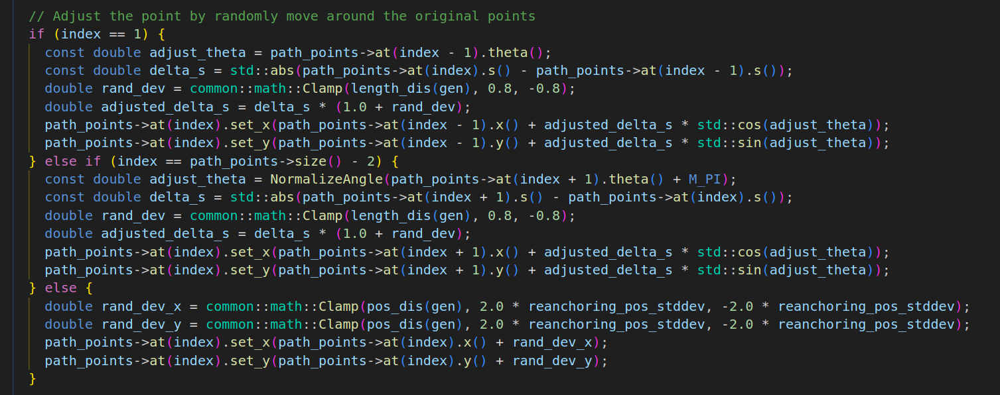
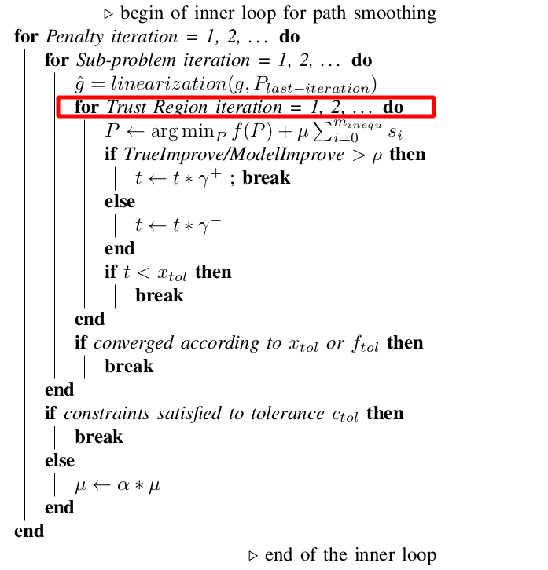
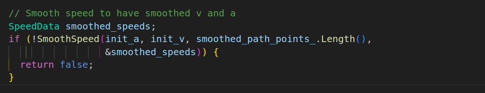

# 参考线平滑

## 1. Discrete Points Smoother

目前百度Apollo中共有三种参考线平滑算法，整体框架结构如下所示：


通过配置参数可以选择需要采用的参考线平滑算法，目前Apollo中默认配置为第一种，DiscretePoints Smoother（基于离散点的平滑）。

具体优化问题的构造及求解的详细过程请参考以下链接：

https://zhuanlan.zhihu.com/p/371585754

https://zhuanlan.zhihu.com/p/342740447

## 2. Open Space Planner

整个Open Space Planner模块如下图所示，由 **ROI**、**Trajectory Generation** 以及 **Trajectory Post-processing**三部分组成：


首先是通过 ROI 确定可行驶区域，然后通过Hybrid A*算法搜索出一条粗糙的路径，然后通过DL-IAPS算法对粗糙的路径进行平滑获得一条满足**曲率约束**，**曲率平滑**的**无碰撞**路径。接下来对平滑后的路径通过PJSO算法速度规划，最后生成一条轨迹。

## 3. DL-IAPS & PJSO  

百度Apollo设计了一种横纵向解耦的OpenSpace规划算法（DL-IAPS & PJSO）。  
**路径规划**：双循环迭代锚定算法（Dual-Loop Iterative Anchoring Path Smoothing，DL-IAPS）。主要包含了两层循环，**外层循环处理避免碰撞，内层循环处理路径平滑**。


**速度规划**：分段加加速度优化（Piece-wise Jerk Speed Optimization，PJSO）  
论文链接：https://arxiv.org/abs/2009.11135  

### 3.1 横向 DL-IAPS

#### 3.1.1 整体流程

1. 对Hybrid A*搜索出的初始路径进行碰撞检测（Hybrid A *搜索出的路径一般是collision free的），如果检测失败，则会对碰撞点的位置进行调整，直至不发生碰撞或超出迭代次数为止。

2. 若存在碰撞点重新锚定失败，则终止程序；若所有碰撞点都重新锚定成功（初始路径不会发生碰撞），则对其进行平滑。
3. 初始路径平滑后会再次进行碰撞检测，若发生碰撞，则会调整碰撞点的边界条件进行重新优化，直至满足碰撞约束或超出迭代次数为止。

#### 3.1.2 碰撞检测原理

**轴对齐包围矩形**（Axis Aligned Bounding Box，AABB），即对于矩形A 和 矩形B，采用**x_min, x_max, y_min, y_max**的方式来描述该矩形，只要在 X 轴 或 Y 轴上没有重合，则这两个矩形不相交。


参考链接：https://zhuanlan.zhihu.com/p/508757803

#### 3.1.3 ReAnchoring

在首次平滑前，会对初始路径进行碰撞检测，若检测失败（初始路径会与障碍物发生碰撞），**则假设平滑失败，并尝试对碰撞点进行重新锚定**。


ReAnchoring过程如下代码所示，**通过随机生成满足一定正态分布的偏移量来调整碰撞点的位置**。如果碰撞点是路径上的第二个点或倒数第二个点时，随机偏移量满足的正态分布为 $N(0, 0.25^2)$ ，其取值范围为 $(-0.8～0.8)$ ；否则，随机偏移量满足的正态分布为 $N(0, 1)$，其取值范围为 $(-0.5～0.5)$ 。




不同的均值和标准差会对生成的随机数产生不同的影响。均值决定了随机数的中心位置，而标准差决定了随机数的分布范围，此处不作过多讨论。

#### 3.1.4 SmoothPath

确保初始路径无碰撞之后再对其进行平滑，默认采用FemPosSmooth散点平滑算法，其又包括QP，NLP，SQP三种算法。理论上选择哪个平滑算法都可以，如果考虑参考线的曲率约束，其优化问题是非线性的，可以使用ipopt非线性求解器求解，也可以将曲率约束线性化后使用osqp求解器来用SQP方法求解；如果不考虑曲率约束，则直接用osqp求解二次规划问题。


##### 3.1.4.1 **Inner Loop for Curvature Constrained Path Smoothing**

**论文中用的散点平滑方法是SQP序列二次规划算法**，首先代码中在算法开始前会用OSQP求一个初始解再代入SQP计算。


SQP优化过程中会迭代求解最优，且SQP迭代也有内外嵌套的两个Loop，内层是对代价函数的迭代下降，外层是对约束的收紧：

（1）SQP内层循环通过不断求解和更新目标函数值使其达到最优解，有两个退出条件：a. 目标函数 $f$ 收敛；b. 超出规定迭代次数。

（2）SQP外层循环通过增大松弛变量约束，使每次迭代的曲率约束越来越严格，保证最终平滑的路径能满足曲率约束，也有两个退出条件：a. 满足曲率约束；b. 超出规定迭代次数。


伪代码中还有一个信赖域迭代循环（ $Trust$  $Tegion$  $iteration$ ）在代码中并未体现。



##### 3.1.4.2 **Out Loop for Collision Avoidance**

优化生成的平滑 path 会对所有的障碍物进行碰撞检测，如果通过碰撞检测，则输出 path ，**如果没能通过碰撞检测，则将碰撞点记录下来，收缩对应 path 点的 bubble region (也就是约束条件中的 $B_k$ )**，使得下轮优化过程中 path 点的无碰撞区域更小。下面这个图形象解释了这个过程：上一次迭代中，bubble region是蓝色圈圈，发现没通过碰撞检测，这一次将会收缩蓝色圈圈，变成红色圈圈，然后进到下一次迭代。


伪代码：


代码实现如下所示：


参考链接：https://mp.weixin.qq.com/s/MwTVTHn5kK8c5a9PzyhD4Q

### 3.2 纵向 PJSO

#### 3.2.1 SmoothSpeed

经SmoothPath平滑之后的路径包含的信息有：x， y，phi， kappa，s。在此基础上通过SmoothSpeed进一步平滑v，a。最后将两者结合生成最终的离散轨迹discretized_trajectory。




具体优化问题的构造及求解的详细过程请参考以下链接：

https://zhuanlan.zhihu.com/p/325645742

https://zhuanlan.zhihu.com/p/564029220

## 4. Usage


### 4.1 ThirdParty Installation

**Eigen3**

```
sudo apt install libeigen3-dev  
```

**osqp-0.4.1**

```
git clone https://github.com/osqp/osqp.git
cd osqp
git checkout v0.4.1  ## 切换到v0.4.1分支
mkdir build && cd build  
cmake ..  
make  
sudo make install  
```

**osqp-eigen**

```
git clone https://github.com/robotology/osqp-eigen.git  
cd osqp-eigen  
mkdir build && cd build  
cmake ..  
make  
sudo make install  
```

**Protobuf**

```
sudo apt install libprotobuf-dev protobuf-compiler 
```

**Boost**

```
sudo apt install libboost-all-dev 
```

**matplotlib-cpp**

```
git clone https://github.com/lava/matplotlib-cpp.git  
cd matplotlib-cpp  
mkdir build && cd build  
cmake ..  
make  
sudo make install  
```

**Ipopt**

```
## 安装依赖
sudo apt-get install gcc g++ gfortran git patch wget pkg-config liblapack-dev libmetis-dev libblas-dev 

## 安装ASL
git clone https://github.com/coin-or-tools/ThirdParty-ASL.git
cd ThirdParty-ASL
sudo ./get.ASL
sudo ./configure
make
sudo make install
cd ..

## 安装HSL
git clone https://github.com/coin-or-tools/ThirdParty-HSL.git
cd ThirdParty-HSL
# 接下来需要下载coinhsl文件（https://github.com/CHH3213/testCPP/blob/master/coinhsl.zip），并解压到ThirdParty-HSL目录下
sudo ./configure
make
sudo make install
cd ..

## 安装MUMPS
git clone https://github.com/coin-or-tools/ThirdParty-Mumps.git
cd ThirdParty-Mumps
sudo ./get.Mumps
sudo ./configure
make
sudo make install
cd ..

## 安装Ipopt
git clone https://github.com/coin-or/Ipopt.git
cd Ipopt
mkdir build && cd build
sudo ../configure
make
sudo make install
```

**abseil-cpp**

```
git clone https://github.com/abseil/abseil-cpp.git
cd abseil-cpp
mkdir build && cd build  
cmake ..
make
sudo make install  
```

### 4.2 Compile & Run

**编译Protobuf**

```
cd proto
protoc -I=./ --cpp_out=./ *.proto  
cd ..
```

**编译&执行**

```
mkdir build && cd build
cmake ..
make -j8
./DiscretePointsSmoother
```

## 5. 路径平滑效果  
  
  
